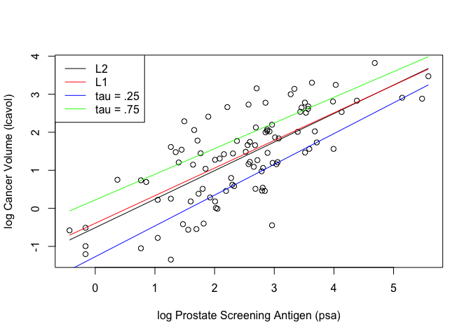
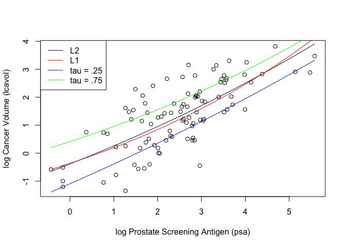

    library('ElemStatLearn')

    ## Warning: package 'ElemStatLearn' was built under R version 3.5.2

    ## load prostate data
    data("prostate")

    ## subset to training examples
    prostate_train <- subset(prostate, train=TRUE)

    ## plot lcavol vs lpsa
    plot_psa_data <- function(dat=prostate_train) {
      plot(dat$lpsa, dat$lcavol,
           xlab="log Prostate Screening Antigen (psa)",
           ylab="log Cancer Volume (lcavol)")
    }

    ## L2 loss function
    L2_loss <- function(y, yhat)
      (y-yhat)^2

    ## L1 loss function
    L1_loss <- function(y,yhat)
      abs(y - yhat)

    ## tilted absolute loss function
    tilt_abs_loss <- function(y,yhat,tau)
      ifelse((y-yhat) > 0, tau*(y - yhat), (tau-1)*(y - yhat))
      

    #### Linear Model ####
    fit_lin <- function(y, x, loss=L2_loss, beta_init = c(-0.51, 0.75),tau = 0) {
      if(tau == 0) {
        err <- function(beta) #training error function
          mean(loss(y,  beta[1] + beta[2]*x)) #computes average loss in training data
      } else{ 
        err <- function(beta) 
          mean(loss(y,  beta[1] + beta[2]*x,tau = tau))
      }
      beta <- optim(par = beta_init, fn = err) #optimizes
      
      return(beta)
    }

    ## make predictions from linear model
    predict_lin <- function(x, beta)
      beta[1] + beta[2]*x

    ## fit linear model
    lin_betaL2 <- fit_lin(y=prostate_train$lcavol,
                        x=prostate_train$lpsa,
                        loss=L2_loss)
    lin_betaL1 <-  fit_lin(y=prostate_train$lcavol,
                           x=prostate_train$lpsa,
                           loss=L1_loss)
    lin_betaTilt <- fit_lin(y=prostate_train$lcavol,
                            x=prostate_train$lpsa,
                            loss = tilt_abs_loss,
                            tau = 0.25)
    lin_betaTilt2<- fit_lin(y=prostate_train$lcavol,
                             x=prostate_train$lpsa,
                            loss = tilt_abs_loss,
                            tau = .75)

    ## compute predictions for a grid of inputs
    x_grid <- seq(min(prostate_train$lpsa),
                  max(prostate_train$lpsa),
                  length.out=100)
    lin_predL2 <- predict_lin(x=x_grid, beta=lin_betaL2$par)
    lin_predL1 <- predict_lin(x=x_grid, beta=lin_betaL1$par)
    lin_predTilt <- predict_lin(x=x_grid, beta=lin_betaTilt$par)
    lin_predTilt2 <- predict_lin(x=x_grid, beta=lin_betaTilt2$par)

    ## plot data
    plot_psa_data()

    ## plot predictions
    lines(x=x_grid, y=lin_predL2)
    lines(x=x_grid, y=lin_predL1,col = "red")
    lines(x=x_grid, y=lin_predTilt,col = "blue")
    lines(x=x_grid, y=lin_predTilt2,col = "green")
    legend("topleft", legend = c("L2", "L1", "tau = .25", "tau = .75"), col = c("black", "red", "blue","green"),lty = c(1,1,1,1))

    #### Exponential Model ####
    fit_exp <- function(y, x, loss=L2_loss, beta_init = c(-1,0,-.3),tau = 0) {
      
      if(tau == 0) {
        err <- function(beta) #training error function
          mean(loss(y,  beta[1] + beta[2]*exp(-beta[3]*x))) #computes average loss in training data
      } else{ 
        err <- function(beta) 
          mean(loss(y,  beta[1] + beta[2]*exp(-beta[3]*x), tau= tau))
      }
      beta <- optim(par = beta_init, fn = err)  #optimizes
      
      return(beta)
    }

    ## make predictions from exponential model
    predict_exp <- function(x, beta)
      beta[1] + beta[2]*exp(-beta[3]*x)

    ## fit exponential model
    exp_betaL2 <- fit_exp(y=prostate_train$lcavol,
                          x=prostate_train$lpsa,
                          loss=L2_loss)
    exp_betaL1 <-  fit_exp(y=prostate_train$lcavol,
                           x=prostate_train$lpsa,
                           loss=L1_loss)
    exp_betaTilt <- fit_exp(y=prostate_train$lcavol,
                             x=prostate_train$lpsa,
                            loss = tilt_abs_loss,
                            tau = 0.25)
    exp_betaTilt2<- fit_exp(y=prostate_train$lcavol,
                             x=prostate_train$lpsa,
                            loss = tilt_abs_loss,
                            tau = .75)

    ## compute predictions for a grid of inputs
    exp_predL2 <- predict_exp(x=x_grid, beta=exp_betaL2$par)
    exp_predL1 <- predict_exp(x=x_grid, beta=exp_betaL1$par)
    exp_predTilt <- predict_exp(x=x_grid, beta=exp_betaTilt$par)
    exp_predTilt2 <- predict_exp(x=x_grid, beta=exp_betaTilt2$par)

    ## plot data
    plot_psa_data()

    ## plot predictions
    lines(x=x_grid, y=exp_predL2)
    lines(x=x_grid, y=exp_predL1,col = "red")
    lines(x=x_grid, y=exp_predTilt,col = "blue")
    lines(x=x_grid, y=exp_predTilt2,col = "green")
    legend("topleft", legend = c("L2", "L1", "tau = .25", "tau = .75"), col = c("black", "red", "blue","green"),lty = c(1,1,1,1))

