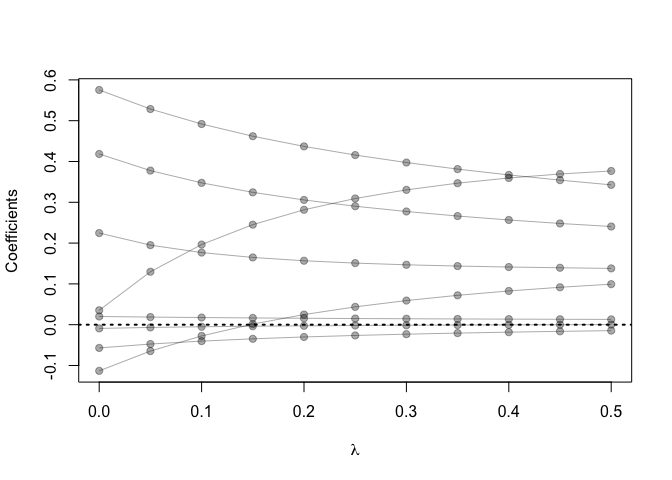
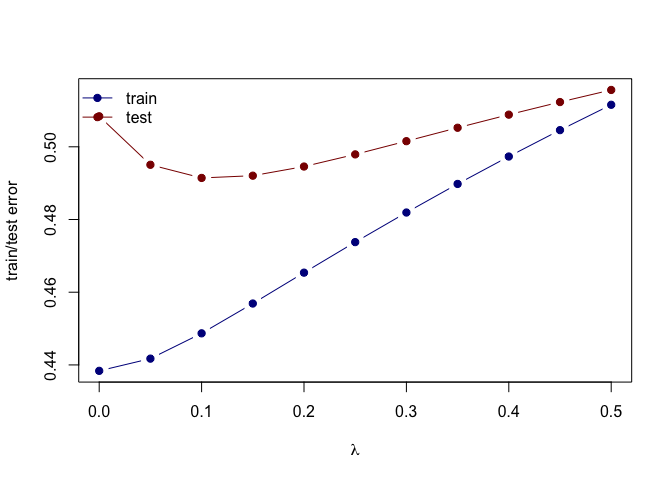

    # Use the prostate cancer data from the ElemStatLearn package for R.
    data('prostate')

    # Use the cor function to reproduce the correlations listed in HTF Table 3.1, page 50.
    pros_cor <- cor(prostate[,-10], method = "pearson")
    pros_cor[upper.tri(pros_cor,diag = TRUE)] <- NA
    pros_cor <- pros_cor[-c(1,9),]
    kable(round(pros_cor,3))

<table>
<thead>
<tr>
<th style="text-align:left;">
</th>
<th style="text-align:right;">
lcavol
</th>
<th style="text-align:right;">
lweight
</th>
<th style="text-align:right;">
age
</th>
<th style="text-align:right;">
lbph
</th>
<th style="text-align:right;">
svi
</th>
<th style="text-align:right;">
lcp
</th>
<th style="text-align:right;">
gleason
</th>
<th style="text-align:right;">
pgg45
</th>
<th style="text-align:right;">
lpsa
</th>
</tr>
</thead>
<tbody>
<tr>
<td style="text-align:left;">
lweight
</td>
<td style="text-align:right;">
0.281
</td>
<td style="text-align:right;">
NA
</td>
<td style="text-align:right;">
NA
</td>
<td style="text-align:right;">
NA
</td>
<td style="text-align:right;">
NA
</td>
<td style="text-align:right;">
NA
</td>
<td style="text-align:right;">
NA
</td>
<td style="text-align:right;">
NA
</td>
<td style="text-align:right;">
NA
</td>
</tr>
<tr>
<td style="text-align:left;">
age
</td>
<td style="text-align:right;">
0.225
</td>
<td style="text-align:right;">
0.348
</td>
<td style="text-align:right;">
NA
</td>
<td style="text-align:right;">
NA
</td>
<td style="text-align:right;">
NA
</td>
<td style="text-align:right;">
NA
</td>
<td style="text-align:right;">
NA
</td>
<td style="text-align:right;">
NA
</td>
<td style="text-align:right;">
NA
</td>
</tr>
<tr>
<td style="text-align:left;">
lbph
</td>
<td style="text-align:right;">
0.027
</td>
<td style="text-align:right;">
0.442
</td>
<td style="text-align:right;">
0.350
</td>
<td style="text-align:right;">
NA
</td>
<td style="text-align:right;">
NA
</td>
<td style="text-align:right;">
NA
</td>
<td style="text-align:right;">
NA
</td>
<td style="text-align:right;">
NA
</td>
<td style="text-align:right;">
NA
</td>
</tr>
<tr>
<td style="text-align:left;">
svi
</td>
<td style="text-align:right;">
0.539
</td>
<td style="text-align:right;">
0.155
</td>
<td style="text-align:right;">
0.118
</td>
<td style="text-align:right;">
-0.086
</td>
<td style="text-align:right;">
NA
</td>
<td style="text-align:right;">
NA
</td>
<td style="text-align:right;">
NA
</td>
<td style="text-align:right;">
NA
</td>
<td style="text-align:right;">
NA
</td>
</tr>
<tr>
<td style="text-align:left;">
lcp
</td>
<td style="text-align:right;">
0.675
</td>
<td style="text-align:right;">
0.165
</td>
<td style="text-align:right;">
0.128
</td>
<td style="text-align:right;">
-0.007
</td>
<td style="text-align:right;">
0.673
</td>
<td style="text-align:right;">
NA
</td>
<td style="text-align:right;">
NA
</td>
<td style="text-align:right;">
NA
</td>
<td style="text-align:right;">
NA
</td>
</tr>
<tr>
<td style="text-align:left;">
gleason
</td>
<td style="text-align:right;">
0.432
</td>
<td style="text-align:right;">
0.057
</td>
<td style="text-align:right;">
0.269
</td>
<td style="text-align:right;">
0.078
</td>
<td style="text-align:right;">
0.320
</td>
<td style="text-align:right;">
0.515
</td>
<td style="text-align:right;">
NA
</td>
<td style="text-align:right;">
NA
</td>
<td style="text-align:right;">
NA
</td>
</tr>
<tr>
<td style="text-align:left;">
pgg45
</td>
<td style="text-align:right;">
0.434
</td>
<td style="text-align:right;">
0.107
</td>
<td style="text-align:right;">
0.276
</td>
<td style="text-align:right;">
0.078
</td>
<td style="text-align:right;">
0.458
</td>
<td style="text-align:right;">
0.632
</td>
<td style="text-align:right;">
0.752
</td>
<td style="text-align:right;">
NA
</td>
<td style="text-align:right;">
NA
</td>
</tr>
</tbody>
</table>
    # Treat lpsa as the oucome, and use all other variables in the data set as predictors.
    # With the training subset, train a least-squares regression model with all predictors using # the lm function (with the training subset).

    prostate_train <- prostate %>%
      filter(train == TRUE) %>% 
      select(-train)

    fit <- lm(lpsa ~ ., data = prostate_train)

    #Use the testing subset to compute the test error using the fitted least-squares regression model.

    prostate_test <- prostate %>%
      filter(train == FALSE) %>% 
      select(-train)

    L2_loss <- function(y, yhat)
      (y-yhat)^2

    error <- function(dat, fit, loss=L2_loss)
      mean(loss(dat$lcavol, predict(fit, newdata=dat)))

    error(prostate_test, fit)

    ## [1] 1.474148

    # Train a ridge regression model using the glmnet function, and tune the value of lambda.

    form  <- lcavol ~ 0 + lweight + age + lbph + lcp + pgg45 + lpsa + svi + gleason
    x_inp <- model.matrix(form, data=prostate_train) 

    y_out <- prostate_train$lcavol
    fit <- glmnet(x=x_inp, y=y_out, alpha = 0, lambda=seq(0.5, 0, -0.05)) 
    print(fit$beta)

    ## 8 x 11 sparse Matrix of class "dgCMatrix"

    ##    [[ suppressing 11 column names 's0', 's1', 's2' ... ]]

    ##                                                                
    ## lweight  0.0993164708  9.167566e-02  0.0826683948  0.0719539791
    ## age      0.0129153943  1.324527e-02  0.0136179441  0.0140406458
    ## lbph    -0.0145798645 -1.634009e-02 -0.0183250211 -0.0206075810
    ## lcp      0.2406189663  2.481045e-01  0.2566365965  0.2662889674
    ## pgg45    0.0002559092 -6.282802e-05 -0.0004352183 -0.0008738898
    ## lpsa     0.3427088262  3.542773e-01  0.3670625828  0.3813402190
    ## svi      0.3767521726  3.693591e-01  0.3595330020  0.3468674180
    ## gleason  0.1379543516  1.394770e-01  0.1413173561  0.1436779615
    ##                                                                         
    ## lweight  0.059127616  0.043652593  0.024777969  0.001504802 -0.027603986
    ## age      0.014526957  0.015088490  0.015748487  0.016532948  0.017480107
    ## lbph    -0.023258103 -0.026377963 -0.030098852 -0.034621150 -0.040241264
    ## lcp      0.277447149  0.290342311  0.305728439  0.324372008  0.347616547
    ## pgg45   -0.001398912 -0.002031353 -0.002810371 -0.003788173 -0.005050263
    ## lpsa     0.397429712  0.415786556  0.437009864  0.461951799  0.491849702
    ## svi      0.330415198  0.309283880  0.281608260  0.245177911  0.196427346
    ## gleason  0.146778188  0.150949425  0.156678907  0.164800413  0.176722769
    ##                                  
    ## lweight -0.064680201 -0.113137304
    ## age      0.018643148  0.020098181
    ## lbph    -0.047425776 -0.056962692
    ## lcp      0.377657417  0.418431830
    ## pgg45   -0.006739814 -0.009116838
    ## lpsa     0.528596455  0.575318051
    ## svi      0.129711598  0.035342349
    ## gleason  0.194999807  0.224585243

    # Create a path diagram of the ridge regression analysis
    plot(x=range(fit$lambda),
         y=range(as.matrix(fit$beta)),
         type='n',
         xlab=expression(lambda),
         ylab='Coefficients')
    for(i in 1:nrow(fit$beta)) {
      points(x=fit$lambda, y=fit$beta[i,], pch=19, col='#00000055')
      lines(x=fit$lambda, y=fit$beta[i,], col='#00000055')
    }
    abline(h=0, lty=3, lwd=2)

    # Create a figure that shows the training and test error associated with ridge regression as a function of lambda

    error <- function(dat, fit, lam, form, loss=L2_loss) {
      x_inp <- model.matrix(form, data=dat)
      y_out <- dat$lcavol
      y_hat <- predict(fit, newx=x_inp, s=lam)  ## see predict.elnet
      mean(loss(y_out, y_hat))
    }

    err_train_1 <- sapply(fit$lambda, function(lam) 
      error(prostate_train, fit, lam, form))
    err_test_1 <- sapply(fit$lambda, function(lam) 
      error(prostate_test, fit, lam, form))

    plot(x=range(fit$lambda),
         y=range(c(err_train_1, err_test_1)),
         type='n',
         xlab=expression(lambda),
         ylab='train/test error')
    points(fit$lambda, err_train_1, pch=19, type='b', col='darkblue')
    points(fit$lambda, err_test_1, pch=19, type='b', col='darkred')
    legend('topleft', c('train','test'), lty=1, pch=19,
           col=c('darkblue','darkred'), bty='n')

    colnames(fit$beta) <- paste('lam =', fit$lambda)
    print(fit$beta %>% as.matrix)

    ##             lam = 0.5    lam = 0.45     lam = 0.4    lam = 0.35
    ## lweight  0.0993164708  9.167566e-02  0.0826683948  0.0719539791
    ## age      0.0129153943  1.324527e-02  0.0136179441  0.0140406458
    ## lbph    -0.0145798645 -1.634009e-02 -0.0183250211 -0.0206075810
    ## lcp      0.2406189663  2.481045e-01  0.2566365965  0.2662889674
    ## pgg45    0.0002559092 -6.282802e-05 -0.0004352183 -0.0008738898
    ## lpsa     0.3427088262  3.542773e-01  0.3670625828  0.3813402190
    ## svi      0.3767521726  3.693591e-01  0.3595330020  0.3468674180
    ## gleason  0.1379543516  1.394770e-01  0.1413173561  0.1436779615
    ##            lam = 0.3   lam = 0.25    lam = 0.2   lam = 0.15    lam = 0.1
    ## lweight  0.059127616  0.043652593  0.024777969  0.001504802 -0.027603986
    ## age      0.014526957  0.015088490  0.015748487  0.016532948  0.017480107
    ## lbph    -0.023258103 -0.026377963 -0.030098852 -0.034621150 -0.040241264
    ## lcp      0.277447149  0.290342311  0.305728439  0.324372008  0.347616547
    ## pgg45   -0.001398912 -0.002031353 -0.002810371 -0.003788173 -0.005050263
    ## lpsa     0.397429712  0.415786556  0.437009864  0.461951799  0.491849702
    ## svi      0.330415198  0.309283880  0.281608260  0.245177911  0.196427346
    ## gleason  0.146778188  0.150949425  0.156678907  0.164800413  0.176722769
    ##           lam = 0.05      lam = 0
    ## lweight -0.064680201 -0.113137304
    ## age      0.018643148  0.020098181
    ## lbph    -0.047425776 -0.056962692
    ## lcp      0.377657417  0.418431830
    ## pgg45   -0.006739814 -0.009116838
    ## lpsa     0.528596455  0.575318051
    ## svi      0.129711598  0.035342349
    ## gleason  0.194999807  0.224585243
