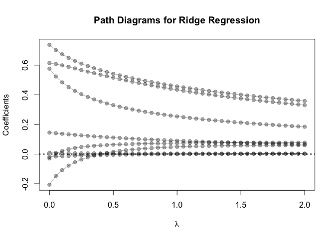
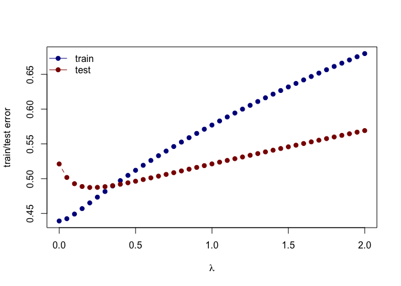

Use the prostate cancer data from the ElemStatLearn package for R.

    data('prostate')

    # subset to training data
    prostate_train <- prostate %>%
      filter(train == TRUE) %>% 
      select(-train)

    #subset to testing data
    prostate_test <- prostate %>%
      filter(train == FALSE) %>% 
      select(-train)

Use the cor function to reproduce the correlations listed in HTF Table
3.1, page 50.

    # only using training data
    pros_cor <- cor(prostate_train, method = "pearson")
    pros_cor <- round(pros_cor[-c(1,9),-c(8,9)],3)
    pros_cor[upper.tri(pros_cor)] <- NA
    pros_cor

    ##         lcavol lweight   age   lbph   svi   lcp gleason
    ## lweight  0.300      NA    NA     NA    NA    NA      NA
    ## age      0.286   0.317    NA     NA    NA    NA      NA
    ## lbph     0.063   0.437 0.287     NA    NA    NA      NA
    ## svi      0.593   0.181 0.129 -0.139    NA    NA      NA
    ## lcp      0.692   0.157 0.173 -0.089 0.671    NA      NA
    ## gleason  0.426   0.024 0.366  0.033 0.307 0.476      NA
    ## pgg45    0.483   0.074 0.276 -0.030 0.481 0.663   0.757

Treat lpsa as the oucome, and use all other variables in the data set as
predictors.With the training subset, train a least-squares regression
model with all predictors using the lm function (with the training
subset).

    fit <- lm(lpsa ~ ., data = prostate_train)
    summary(fit)

    ## 
    ## Call:
    ## lm(formula = lpsa ~ ., data = prostate_train)
    ## 
    ## Residuals:
    ##      Min       1Q   Median       3Q      Max 
    ## -1.64870 -0.34147 -0.05424  0.44941  1.48675 
    ## 
    ## Coefficients:
    ##              Estimate Std. Error t value Pr(>|t|)    
    ## (Intercept)  0.429170   1.553588   0.276  0.78334    
    ## lcavol       0.576543   0.107438   5.366 1.47e-06 ***
    ## lweight      0.614020   0.223216   2.751  0.00792 ** 
    ## age         -0.019001   0.013612  -1.396  0.16806    
    ## lbph         0.144848   0.070457   2.056  0.04431 *  
    ## svi          0.737209   0.298555   2.469  0.01651 *  
    ## lcp         -0.206324   0.110516  -1.867  0.06697 .  
    ## gleason     -0.029503   0.201136  -0.147  0.88389    
    ## pgg45        0.009465   0.005447   1.738  0.08755 .  
    ## ---
    ## Signif. codes:  0 '***' 0.001 '**' 0.01 '*' 0.05 '.' 0.1 ' ' 1
    ## 
    ## Residual standard error: 0.7123 on 58 degrees of freedom
    ## Multiple R-squared:  0.6944, Adjusted R-squared:  0.6522 
    ## F-statistic: 16.47 on 8 and 58 DF,  p-value: 2.042e-12

Use the testing subset to compute the test error using the fitted
least-squares regression model.

    # L_2 loss function
    L2_loss <- function(y, yhat)
      (y-yhat)^2

    # error function
    error <- function(dat, fit, loss=L2_loss)
      mean(loss(dat$lpsa, predict(fit, newdata=dat)))

    # testing error
    (test_error <- error(prostate_test, fit) %>% round(3))

    ## [1] 0.521

Train a ridge regression model using the glmnet function, and tune the
value of lambda.

    # setting up ridge regression model formula and input matrix
    form  <- lpsa ~ 0 +  lcavol + lweight + age + lbph + lcp + pgg45  + svi + gleason
    x_inp <- model.matrix(form, data=prostate_train) 
    y_out <- prostate_train$lpsa

    #
    lambda = seq(2, 0, -0.05)
    fit_rr <- glmnet(x=x_inp, y=y_out, alpha = 0, lambda=lambda) 
    print(fit_rr$beta)

    ## 8 x 41 sparse Matrix of class "dgCMatrix"

    ##    [[ suppressing 41 column names 's0', 's1', 's2' ... ]]

    ##                                                                    
    ## lcavol  0.184307741 0.186696737 0.189170073 0.191723724 0.194362274
    ## lweight 0.330440497 0.334389434 0.338444220 0.342602559 0.346868528
    ## age     0.002612127 0.002540223 0.002464260 0.002383044 0.002296197
    ## lbph    0.066071839 0.066959912 0.067870876 0.068807992 0.069772447
    ## lcp     0.060089373 0.060037419 0.059968634 0.059870513 0.059740211
    ## pgg45   0.003157572 0.003179716 0.003202219 0.003225145 0.003248522
    ## svi     0.358226083 0.361979928 0.365810467 0.369736043 0.373760883
    ## gleason 0.076945651 0.077041781 0.077117839 0.077178298 0.077221960
    ##                                                                    
    ## lcavol  0.197090719 0.199914492 0.202839516 0.205872264 0.209019826
    ## lweight 0.351246426 0.355740777 0.360356348 0.365098162 0.369971510
    ## age     0.002203306 0.002103920 0.001997547 0.001883649 0.001761635
    ## lbph    0.070765501 0.071788496 0.072842861 0.073930122 0.075051907
    ## lcp     0.059574542 0.059369960 0.059122515 0.058827792 0.058480847
    ## pgg45   0.003272378 0.003296749 0.003321671 0.003347190 0.003373354
    ## svi     0.377889515 0.382126794 0.386477934 0.390948548 0.395544693
    ## gleason 0.077247547 0.077253675 0.077238849 0.077201445 0.077139698
    ##                                                                    
    ## lcavol  0.212289988 0.215691325 0.219233309 0.222926431 0.226782358
    ## lweight 0.374981973 0.380135434 0.385438096 0.390896501 0.396517542
    ## age     0.001630858 0.001490605 0.001340091 0.001178446 0.001004710
    ## lbph    0.076209958 0.077406140 0.078642452 0.079921040 0.081244210
    ## lcp     0.058076130 0.057607388 0.057067566 0.056448668 0.055741609
    ## pgg45   0.003400221 0.003427858 0.003456342 0.003485760 0.003516219
    ## svi     0.400272917 0.405140319 0.410154617 0.415324225 0.420658345
    ## gleason 0.077051686 0.076935312 0.076788279 0.076608062 0.076391884
    ##                                                                          
    ## lcavol  0.2308140982 0.2350362184 0.2394650902 0.2441191927  0.2490194773
    ## lweight 0.4023084843 0.4082769772 0.4144310661 0.4207792007  0.4273302366
    ## age     0.0008178156 0.0006165748 0.0003996617 0.0001655923 -0.0000873004
    ## lbph    0.0826144449 0.0840344214 0.0855070283 0.0870353895  0.0886228876
    ## lcp     0.0549360313 0.0540200747 0.0529801116 0.0518004129  0.0504627412
    ## pgg45   0.0035478392 0.0035807655 0.0036151683 0.0036512505  0.0036892552
    ## svi     0.4261670780 0.4318615464 0.4377540522 0.4438582586  0.4501894135
    ## gleason 0.0761366666 0.0758389925 0.0754950421 0.0751005230  0.0746505785
    ##                                                               
    ## lcavol   0.2541898137  0.2596575368  0.2655017327  0.271669795
    ## lweight  0.4340934283  0.4410784085  0.4483152574  0.455776082
    ## age     -0.0003608943 -0.0006573136 -0.0009779381 -0.001327548
    ## lbph     0.0902731913  0.0919902863  0.0937691583  0.095632056
    ## lcp      0.0489458458  0.0472248325  0.0452686164  0.043043342
    ## pgg45    0.0037294749  0.0037722639  0.0038168211  0.003865975
    ## svi      0.4567646216  0.4636031800  0.4706808339  0.478111303
    ## gleason  0.0741396703  0.0735614267  0.0729138015  0.072179687
    ##                                                                         
    ## lcavol   0.278247039  0.285283573  0.292838962  0.300984398  0.309805781
    ## lweight  0.463489816  0.471466883  0.479717616  0.488251801  0.497078149
    ## age     -0.001708275 -0.002123757 -0.002578184 -0.003076439 -0.003624239
    ## lbph     0.097575685  0.099605667  0.101728088  0.103949590  0.106277432
    ## lcp      0.040507783  0.037611651  0.034294139  0.030480814  0.026079669
    ## pgg45    0.003919292  0.003977594  0.004041912  0.004113561  0.004194238
    ## svi      0.485880176  0.494021252  0.502573697  0.511583877  0.521107304
    ## gleason  0.071352134  0.070418777  0.069364294  0.068169502  0.066809878
    ##                                                                          
    ## lcavol   0.319407864  0.329986502  0.341589581  0.3544771886  0.368972918
    ## lweight  0.506203510  0.515663416  0.525401205  0.5354348214  0.545774936
    ## age     -0.004228336 -0.004894499 -0.005636564 -0.0064641974 -0.007389019
    ## lbph     0.108719539  0.111267751  0.113960468  0.1167938793  0.119761396
    ## lcp      0.020975708  0.015031241  0.008037959 -0.0002374821 -0.010099378
    ## pgg45    0.004286158  0.004390818  0.004514721  0.0046621274  0.004839771
    ## svi      0.531211269  0.541887050  0.553403895  0.5658135809  0.579176718
    ## gleason  0.065253378  0.063454601  0.061362237  0.0588887300  0.055895060
    ##                                                                         
    ## lcavol   0.385350033  0.404130918  0.426074441  0.452123247  0.483787288
    ## lweight  0.556333416  0.567063929  0.577889623  0.588568720  0.598709576
    ## age     -0.008433635 -0.009618197 -0.010967693 -0.012522584 -0.014334831
    ## lbph     0.122899867  0.126206606  0.129663881  0.133291299  0.137089205
    ## lcp     -0.022038917 -0.036651184 -0.054804333 -0.077864474 -0.107951309
    ## pgg45    0.005060079  0.005338760  0.005700404  0.006186666  0.006865954
    ## svi      0.593901939  0.610203738  0.628338820  0.649022507  0.673210509
    ## gleason  0.052234345  0.047604314  0.041500842  0.033144271  0.021129661
    ##                                  
    ## lcavol   0.523682897  0.576361989
    ## lweight  0.607672220  0.614010456
    ## age     -0.016464993 -0.019004296
    ## lbph     0.140983846  0.144877454
    ## lcp     -0.148533504 -0.206098858
    ## pgg45    0.007867088  0.009452544
    ## svi      0.701932250  0.737221825
    ## gleason  0.002465277 -0.029176315

    # Ridge regression error function
    error <- function(dat, fit, lam, form, loss=L2_loss) {
      x_inp <- model.matrix(form, data=dat)
      y_out <- dat$lpsa
      y_hat <- predict(fit, newx=x_inp, s=lam)  ## see predict.elnet
      mean(loss(y_out, y_hat))
    }

    # testing error
    err_test_1 <- sapply(fit_rr$lambda, function(lam) 
      error(prostate_test, fit_rr, lam, form))

    # value of lambda to be chosen since it minimizes testing error
    (lambda_tuned <- lambda[which.min(err_test_1)])

    ## [1] 0.2

Create a path diagram of the ridge regression analysis

    # setting up plot
    plot(x=range(fit_rr$lambda),
         y=range(as.matrix(fit_rr$beta)),
         type='n',
         xlab=expression(lambda),
         ylab='Coefficients',
         main = "Path Diagrams for Ridge Regression")

    # plotting path for each coefficient for every lambda
    for(i in 1:nrow(fit_rr$beta)) {
      points(x=fit_rr$lambda, y=fit_rr$beta[i,], pch=19, col='#00000055')
      lines(x=fit_rr$lambda, y=fit_rr$beta[i,], col='#00000055')
    }
    abline(h=0, lty=3, lwd=2)

Create a figure that shows the training and test error associated with
ridge regression as a function of lambda

    # training error
    err_train_1 <- sapply(fit_rr$lambda, function(lam) 
      error(prostate_train, fit_rr, lam, form))

    # plotting testing error and training error
    plot(x=range(fit_rr$lambda),
         y=range(c(err_train_1, err_test_1)),
         type='n',
         xlab=expression(lambda),
         ylab='train/test error')
    points(fit_rr$lambda, err_train_1, pch=19, type='b', col='darkblue')
    points(fit_rr$lambda, err_test_1, pch=19, type='b', col='darkred')
    legend('topleft', c('train','test'), lty=1, pch=19,
           col=c('darkblue','darkred'), bty='n')

    colnames(fit_rr$beta) <- paste('lam =', fit_rr$lambda)
    print(fit_rr$beta %>% as.matrix)

    ##             lam = 2  lam = 1.95   lam = 1.9  lam = 1.85   lam = 1.8
    ## lcavol  0.184307741 0.186696737 0.189170073 0.191723724 0.194362274
    ## lweight 0.330440497 0.334389434 0.338444220 0.342602559 0.346868528
    ## age     0.002612127 0.002540223 0.002464260 0.002383044 0.002296197
    ## lbph    0.066071839 0.066959912 0.067870876 0.068807992 0.069772447
    ## lcp     0.060089373 0.060037419 0.059968634 0.059870513 0.059740211
    ## pgg45   0.003157572 0.003179716 0.003202219 0.003225145 0.003248522
    ## svi     0.358226083 0.361979928 0.365810467 0.369736043 0.373760883
    ## gleason 0.076945651 0.077041781 0.077117839 0.077178298 0.077221960
    ##          lam = 1.75   lam = 1.7  lam = 1.65   lam = 1.6  lam = 1.55
    ## lcavol  0.197090719 0.199914492 0.202839516 0.205872264 0.209019826
    ## lweight 0.351246426 0.355740777 0.360356348 0.365098162 0.369971510
    ## age     0.002203306 0.002103920 0.001997547 0.001883649 0.001761635
    ## lbph    0.070765501 0.071788496 0.072842861 0.073930122 0.075051907
    ## lcp     0.059574542 0.059369960 0.059122515 0.058827792 0.058480847
    ## pgg45   0.003272378 0.003296749 0.003321671 0.003347190 0.003373354
    ## svi     0.377889515 0.382126794 0.386477934 0.390948548 0.395544693
    ## gleason 0.077247547 0.077253675 0.077238849 0.077201445 0.077139698
    ##           lam = 1.5  lam = 1.45   lam = 1.4  lam = 1.35   lam = 1.3
    ## lcavol  0.212289988 0.215691325 0.219233309 0.222926431 0.226782358
    ## lweight 0.374981973 0.380135434 0.385438096 0.390896501 0.396517542
    ## age     0.001630858 0.001490605 0.001340091 0.001178446 0.001004710
    ## lbph    0.076209958 0.077406140 0.078642452 0.079921040 0.081244210
    ## lcp     0.058076130 0.057607388 0.057067566 0.056448668 0.055741609
    ## pgg45   0.003400221 0.003427858 0.003456342 0.003485760 0.003516219
    ## svi     0.400272917 0.405140319 0.410154617 0.415324225 0.420658345
    ## gleason 0.077051686 0.076935312 0.076788279 0.076608062 0.076391884
    ##           lam = 1.25    lam = 1.2   lam = 1.15    lam = 1.1    lam = 1.05
    ## lcavol  0.2308140982 0.2350362184 0.2394650902 0.2441191927  0.2490194773
    ## lweight 0.4023084843 0.4082769772 0.4144310661 0.4207792007  0.4273302366
    ## age     0.0008178156 0.0006165748 0.0003996617 0.0001655923 -0.0000873004
    ## lbph    0.0826144449 0.0840344214 0.0855070283 0.0870353895  0.0886228876
    ## lcp     0.0549360313 0.0540200747 0.0529801116 0.0518004129  0.0504627412
    ## pgg45   0.0035478392 0.0035807655 0.0036151683 0.0036512505  0.0036892552
    ## svi     0.4261670780 0.4318615464 0.4377540522 0.4438582586  0.4501894135
    ## gleason 0.0761366666 0.0758389925 0.0754950421 0.0751005230  0.0746505785
    ##               lam = 1    lam = 0.95     lam = 0.9   lam = 0.85
    ## lcavol   0.2541898137  0.2596575368  0.2655017327  0.271669795
    ## lweight  0.4340934283  0.4410784085  0.4483152574  0.455776082
    ## age     -0.0003608943 -0.0006573136 -0.0009779381 -0.001327548
    ## lbph     0.0902731913  0.0919902863  0.0937691583  0.095632056
    ## lcp      0.0489458458  0.0472248325  0.0452686164  0.043043342
    ## pgg45    0.0037294749  0.0037722639  0.0038168211  0.003865975
    ## svi      0.4567646216  0.4636031800  0.4706808339  0.478111303
    ## gleason  0.0741396703  0.0735614267  0.0729138015  0.072179687
    ##            lam = 0.8   lam = 0.75    lam = 0.7   lam = 0.65    lam = 0.6
    ## lcavol   0.278247039  0.285283573  0.292838962  0.300984398  0.309805781
    ## lweight  0.463489816  0.471466883  0.479717616  0.488251801  0.497078149
    ## age     -0.001708275 -0.002123757 -0.002578184 -0.003076439 -0.003624239
    ## lbph     0.097575685  0.099605667  0.101728088  0.103949590  0.106277432
    ## lcp      0.040507783  0.037611651  0.034294139  0.030480814  0.026079669
    ## pgg45    0.003919292  0.003977594  0.004041912  0.004113561  0.004194238
    ## svi      0.485880176  0.494021252  0.502573697  0.511583877  0.521107304
    ## gleason  0.071352134  0.070418777  0.069364294  0.068169502  0.066809878
    ##           lam = 0.55    lam = 0.5   lam = 0.45     lam = 0.4   lam = 0.35
    ## lcavol   0.319407864  0.329986502  0.341589581  0.3544771886  0.368972918
    ## lweight  0.506203510  0.515663416  0.525401205  0.5354348214  0.545774936
    ## age     -0.004228336 -0.004894499 -0.005636564 -0.0064641974 -0.007389019
    ## lbph     0.108719539  0.111267751  0.113960468  0.1167938793  0.119761396
    ## lcp      0.020975708  0.015031241  0.008037959 -0.0002374821 -0.010099378
    ## pgg45    0.004286158  0.004390818  0.004514721  0.0046621274  0.004839771
    ## svi      0.531211269  0.541887050  0.553403895  0.5658135809  0.579176718
    ## gleason  0.065253378  0.063454601  0.061362237  0.0588887300  0.055895060
    ##            lam = 0.3   lam = 0.25    lam = 0.2   lam = 0.15
    ## lcavol   0.385350033  0.404130918  0.426074441  0.452123247
    ## lweight  0.556333416  0.567063929  0.577889623  0.588568720
    ## age     -0.008433635 -0.009618197 -0.010967693 -0.012522584
    ## lbph     0.122899867  0.126206606  0.129663881  0.133291299
    ## lcp     -0.022038917 -0.036651184 -0.054804333 -0.077864474
    ## pgg45    0.005060079  0.005338760  0.005700404  0.006186666
    ## svi      0.593901939  0.610203738  0.628338820  0.649022507
    ## gleason  0.052234345  0.047604314  0.041500842  0.033144271
    ##         lam = 0.0999999999999999 lam = 0.0499999999999998      lam = 0
    ## lcavol               0.483787288              0.523682897  0.576361989
    ## lweight              0.598709576              0.607672220  0.614010456
    ## age                 -0.014334831             -0.016464993 -0.019004296
    ## lbph                 0.137089205              0.140983846  0.144877454
    ## lcp                 -0.107951309             -0.148533504 -0.206098858
    ## pgg45                0.006865954              0.007867088  0.009452544
    ## svi                  0.673210509              0.701932250  0.737221825
    ## gleason              0.021129661              0.002465277 -0.029176315
