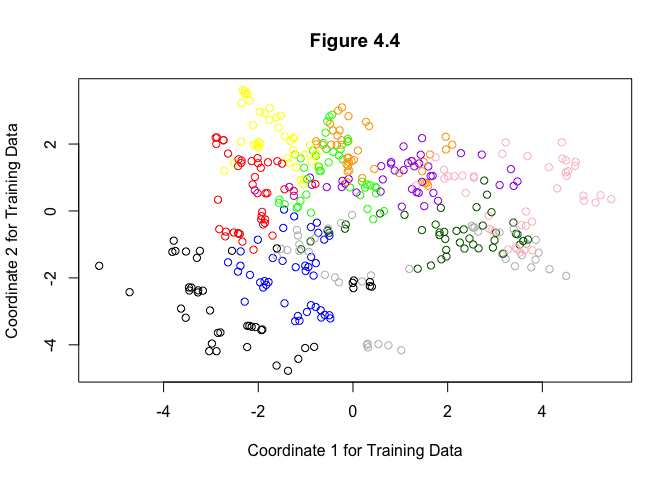
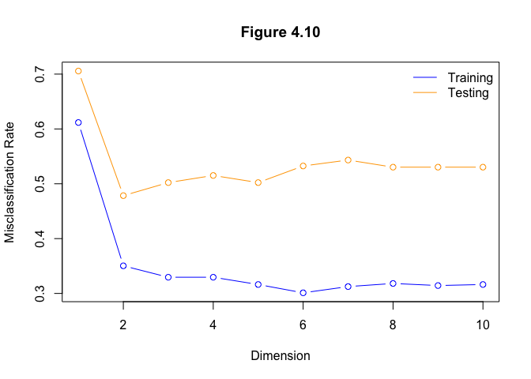

Retrieve the vowel data (training and testing) from the HTF website or R
package.

    ## read vowel training and testing data from HTF website
    data(vowel.train)
    data(vowel.test)

    ## subset training data
    vowel.train %<>%
      mutate(y=as.factor(y))
    vowel.train.y <- vowel.train$y
    vowel.train.x <- vowel.train[paste("x", 1:10, sep=".")]

    ## subset testing data
    vowel.test %<>%
      mutate(y=as.factor(y))
    vowel.test.y <- vowel.test$y
    vowel.test.x <- vowel.test[paste("x", 1:10, sep=".")]

Implement reduced-rank LDA using the vowel training data. Hint: Center
the 10 training predictors before implementing LDA. See built-in R
function ’scale’. The singular value or Eigen decompositions may be
computed using the built-in R functions ’svd’ or ’eigen’, respectively.

    # center train x globally
    vowel.train.x <- as.matrix(vowel.train.x)
    vowel.train.x <- t(t(vowel.train.x) - colMeans(vowel.train.x))

    # center test x globally
    vowel.test.x <- as.matrix(vowel.test.x)
    vowel.test.x <- t(t(vowel.test.x) - colMeans(vowel.test.x))

    # Within-cluster means (train)
    cen.x <- t(sapply(unique(vowel.train.y), function(cls) 
      colMeans(vowel.train.x[vowel.train.y==cls,])))

    # Within-cluster means (train)
    cen.test.x <- t(sapply(unique(vowel.test.y), function(cls) 
      colMeans(vowel.test.x[vowel.test.y==cls,])))

    # Pooled within-cluster vcov
    var.x <- Reduce(`+`, lapply(unique(vowel.train.y), function(cls) {
      x <- vowel.train.x[vowel.train.y == cls,]
      x <-t(t(x) - colMeans(x))
      t(x)%*%x
    }))/(nrow(vowel.train)-11)

    # sphered inputs and centers
    svd.x <- svd(var.x)
    sph.x <- vowel.test.x%*%svd.x$v%*%diag(sqrt(1/svd.x$d))
    sph.c <- cen.x%*%svd.x$v%*%diag(sqrt(1/svd.x$d))

    # canonical inputs and centers
    svd.c <- svd(sph.c)
    can.x <- sph.x%*%svd.c$v
    can.c <- sph.c%*%svd.c$v

    # discriminant function for canonical variables
    disc_fun.c <- function(can.x, mz, K){
      disc <- t(t(can.x[,1:K]) - mz[1:K])
      drop(disc^2%*%rep(1,K))
    }

    # convert discriminant function to original variables
    disc_fun.x <- function(x, mz, K){
      # sphered inputs
      sph.x <- x%*%svd.x$v%*%diag(sqrt(1/svd.x$d))
      # canonical inputs
      can.x <- sph.x%*% svd.c$v
      ouput <- disc_fun.c(can.x, drop(mz), K)
      attr(output, 'can.x') <- can.x
      return(output)
    }

    # compute values of 11 discriminate functions 
    disc_fun.all <- apply(can.c, 1, function(mz)
      disc_fun.c(as.matrix(expand.grid(
        z1 = seq(min(can.x[,1]),max(can.x[,1]),length.out=500), 
        z2 = seq(min(can.x[,1]),max(can.x[,1]),length.out=500))),
        drop(mz), 2))

Check your work by plotting the first two discriminant variables as in
HTF Figure 4.4.

    cols <- c("black","blue","red",
              "yellow","orange","green",
              "purple","pink", "darkgreen",
              "grey")
    plot(can.x[,1],can.x[,2],
           col = cols[vowel.train.y],
         main = "Figure 4.4",
           ylab = "Coordinate 2 for Training Data",
           xlab = "Coordinate 1 for Training Data")

Use the vowel testing data to estimate the expected prediciton error
(assuming zero-one loss), varying the number of canonical variables used
for classification. Plot the EPE as a function of the number of
discriminant variables, and compare this with HTF Figure 4.10.

      # predict classes
      pred_classes_train <- matrix(apply(disc_fun.all,1,which.min), 500)
      pred_classes_test <- matrix(apply(disc_fun.all,1,which.min), 500)
      
      error <- function(data, K = 2){
        
        # input data
        data.x <- as.matrix(data[paste("x", 1:10, sep=".")])
        
        # center input data
        data.x <- t(t(data.x) - colMeans(data[paste("x", 1:10, sep=".")]))
        
        # sphere and canonicalize
        data.c <- data.x%*%svd.x$v%*%diag(sqrt(1/svd.x$d)) %*% svd.c$v
        
        # disccriminant functions
        discs <- apply(can.c,1,function(mz)
          disc_fun.c(data.c,drop(mz),K = K))
        
        # predict class
         preds <- apply(discs,1,which.min)
         
         # error rate
         mean(preds != data$y)
      }
      

    # compute errors  
    error_train <- sapply(1:10, function(K) error(vowel.train, K))
    error_test <- sapply(1:10, function(K) error(vowel.test, K))

    # plot errors
    plot(c(1,10), range(c(error_train,error_test)), type="n",
         xlab="Dimension",
         ylab="Misclassification Rate",
         main="Figure 4.10")
    points(1:10, error_train,type="b",col = "blue")
    points(1:10, error_test, type="b",col = "orange")
    legend("topright", legend=c("Training", "Testing"), lty=1, bty="n", col = c("blue","orange"))

